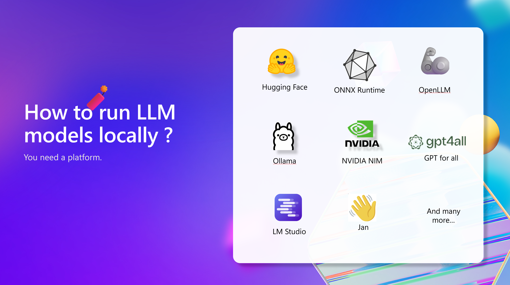

## Introduction

ChatGPT and many online hosted models have revolutionized natural language processing by offering powerful capabilities through cloud-based services. These models provide seamless access to advanced AI features but come with limitations like data privacy concerns and reliance on internet connectivity. To address these issues, deploying large language models (LLMs) locally becomes crucial.

Running LLMs locally ensures data stays within your secure environment, mitigating risks associated with transmitting sensitive information over the internet. Local deployment reduces the latency associated with remote API calls, providing faster response times which are critical for applications needing real-time processing. Additionally, with local deployment, you can fine-tune models to better fit your specific use cases, optimizing performance and accuracy for your particular datasets.

This lab will guide you through running `LLM` models on your local machine and on `AKS`. The lab will use the `ollama` server and client app `Open-WebUI` to deploy the models. The `ollama` server is a REST API server that can run LLM models. The client app is a web-based user interface that can interact with the `ollama` server. 


By the end of this workshop, the `ollama` server and client app will be deployed in `AKS` using `Kubernetes` manifest YAML files.

> In this workshop, ollama is used as a server to run LLM models. But there are multiple other servers available like `Hugging Face`, `ONNX Runtime`, `OpenLLM`, `Nvidia NIM`, `LM Studio`, `Jan`, `GPT for all`, etc that can be used to run LLM models. 

---

## Run LLM models on your local machine

The `ollama` server can run LLM models on your local machine. The `ollama` server can run LLM models like `llama3.1`, `phi3`, `gemma2`, `mistral`, `moondream`, `neural-chat`, `starling`, `codellama`, `llama2-uncensored`, `llava`, and `solar`.

### 2.1. Run `ollama` container

`ollama` server can run as a program in your machine or as a `docker` container. Here are the steps to install `ollama` server as a `docker` container. The container is available in Dockeer Hub: https://hub.docker.com/r/ollama/ollama.

```sh
docker run -d -v ollama:/root/.ollama -p 11434:11434 --name ollama ollama/ollama
```

> For simplicity, we are running `ollama` in `CPU only` mode. Note that it can also support `GPU` and `NPU` for better performance.

### 2.2. Run Microsoft `Phi3.5` LLM model on ollama

```sh
docker exec -it ollama sh -c 'ollama run phi3.5'
# then ctrl + d to exit
```

### 2.3. Run `Open-WebUI` client app

```sh
docker run -d -p 3000:8080 --add-host=host.docker.internal:host-gateway -v open-webui:/app/backend/data -e WEBUI_AUTH=False --name open-webui --restart always ghcr.io/open-webui/open-webui:main
```

Now open your browser on `http://localhost:3000` to access the `Open-WebUI` client app and you can chat with the model.


---

## Run LLM models on AKS

`ollama` and `Open-WebUI` are both available as Docker containers. This makes it easy to deploy it into AKS.

`ollama` and `Open-WebUI` can be deployed in `AKS` using Kubernetes manifests. The `ollama` server will be deployed as a `StatefulSet` with one replica. The `Open-WebUI` client app will be deployed as a `Deployment` with one replica. The `ollama` server and client app will be deployed in the `ollama` namespace.

### 3.1. Create an AKS cluster

Let's first create an AKS cluster using the Azure CLI. Make sure you choose a supported AKS version.

> The choice of Azure CNI Overlay as a network plugin is not required but it is a general recommendation for AKS.

```sh
$AKS_RG="rg-aks-ollama-llm-510"
$AKS_NAME="aks-cluster"

# create resource group
az group create -n $AKS_RG -l swedencentral

# create an AKS cluster 
az aks create -n $AKS_NAME -g $AKS_RG --network-plugin azure --network-plugin-mode overlay -k 1.30.4 --node-vm-size Standard_D2s_v5

# get credentials
az aks get-credentials -n $AKS_NAME -g $AKS_RG --overwrite-existing

# check AKS connection
kubectl get nodes
```

### 3.2. Deploy `ollama` into AKS

`ollama` will be deployed as a `StatefulSet` with one replica. The `ollama` server will run on port `11434`. The `ollama` server will be mounted with a `PersistentVolume` to store the models and logs.

The following Kubernetes manifest will deploy `ollama` into AKS. It creates a `Namespace`, a `StatefulSet`, and an internal `Service` to expose `ollama` server to the client app.

```yaml
# ollama.yaml
apiVersion: v1
kind: Namespace
metadata:
  name: ollama
---
apiVersion: apps/v1
kind: StatefulSet
metadata:
  name: ollama
  namespace: ollama
spec:
  serviceName: ollama
  replicas: 1
  selector:
    matchLabels:
      app: ollama
  template:
    metadata:
      labels:
        app: ollama
    spec:
      containers:
      - name: ollama
        image: ollama/ollama:latest
        ports:
        - containerPort: 11434
        resources:
          requests:
            cpu: "2000m"
            memory: "2Gi"
          limits:
            cpu: "4000m"
            memory: "16Gi"
            nvidia.com/gpu: "0"
        volumeMounts:
        - name: ollama-volume
          mountPath: /root/.ollama
        tty: true
  volumeClaimTemplates:
  - metadata:
      name: ollama-volume
    spec:
      accessModes: [ "ReadWriteOnce" ]
      resources:
        requests:
          storage: 90Gi
---
apiVersion: v1
kind: Service
metadata:
  name: ollama-service
  namespace: ollama
spec:
  type: ClusterIP
  selector:
    app: ollama
  ports:
  - protocol: TCP
    port: 11434
    targetPort: 11434
```

Save this manifest into a file called `ollama.yaml` and apply it to the AKS cluster.

```sh
# deploy Ollama server and client app (Open-WebUI) into AKS
kubectl apply -f ollama.yaml

# check the install
kubectl get all,pv,pvc -n ollama
```

### 3.3. Deploy an LLM model

Now that ollama is running in AKS, you can deploy an LLM model like `phi3.5` or `llama3.1` into the ollama server. To do that you need to exec into the ollama pod and run the model.

```sh
# install LLM model likw phi3.5 or llama3.1 into ollama server
kubectl exec ollama-0 -n ollama -it -- ollama run phi3.5

# or you can run another model like llama3.1
kubectl exec ollama-0 -n ollama -it -- ollama run llama3.1
```

Feel free to choose any LLM model supported by ollama. Here are some example models [available here](https://github.com/ollama/ollama/blob/main/README.md#model-library):

| Model              | Parameters | Size  | Download                       |
| ------------------ | ---------- | ----- | ------------------------------ |
| Llama 3.1          | 8B         | 4.7GB | `ollama run llama3.1`          |
| Llama 3.1          | 70B        | 40GB  | `ollama run llama3.1:70b`      |
| Llama 3.1          | 405B       | 231GB | `ollama run llama3.1:405b`     |
| Phi 3 Mini         | 3.8B       | 2.3GB | `ollama run phi3`              |
| Phi 3 Medium       | 14B        | 7.9GB | `ollama run phi3:medium`       |
| Gemma 2            | 2B         | 1.6GB | `ollama run gemma2:2b`         |
| Gemma 2            | 9B         | 5.5GB | `ollama run gemma2`            |
| Gemma 2            | 27B        | 16GB  | `ollama run gemma2:27b`        |
| Mistral            | 7B         | 4.1GB | `ollama run mistral`           |
| Moondream 2        | 1.4B       | 829MB | `ollama run moondream`         |
| Neural Chat        | 7B         | 4.1GB | `ollama run neural-chat`       |
| Starling           | 7B         | 4.1GB | `ollama run starling-lm`       |
| Code Llama         | 7B         | 3.8GB | `ollama run codellama`         |
| Llama 2 Uncensored | 7B         | 3.8GB | `ollama run llama2-uncensored` |
| LLaVA              | 7B         | 4.5GB | `ollama run llava`             |
| Solar              | 10.7B      | 6.1GB | `ollama run solar`             |

### 3.4. Deploy the client app

The `Open-WebUI` client app can be deployed in AKS as a `Deployment` with one replica. The client app will run on port `3000`. The client app will be mounted with a `PersistentVolume` to store the data.

The following Kubernetes manifest will deploy the client app into AKS. It creates a `Deployment` and a public `Service` to expose the client app to the user.

```yaml
# open-webui.yaml
apiVersion: apps/v1
kind: Deployment
metadata:
  name: open-webui-deployment
  namespace: ollama
spec:
  replicas: 1
  selector:
    matchLabels:
      app: open-webui
  template:
    metadata:
      labels:
        app: open-webui
    spec:
      containers:
      - name: open-webui
        image: ghcr.io/open-webui/open-webui:main
        ports:
        - containerPort: 8080
        resources:
          requests:
            cpu: "500m"
            memory: "500Mi"
          limits:
            cpu: "1000m"
            memory: "1Gi"
        env:
        - name: OLLAMA_BASE_URL
          value: "http://ollama-service.ollama.svc.cluster.local:11434"
        - name: WEBUI_AUTH
          value: "True"
        
        tty: true
        volumeMounts:
        - name: webui-volume
          mountPath: /app/backend/data
      volumes:
      - name: webui-volume
        persistentVolumeClaim:
          claimName: open-webui-pvc
---
apiVersion: v1
kind: PersistentVolumeClaim
metadata:
  labels:
    app: open-webui
  name: open-webui-pvc
  namespace: ollama
spec:
  accessModes: ["ReadWriteOnce"]
  resources:
    requests:
      storage: 2Gi
---
apiVersion: v1
kind: Service
metadata:
  name: open-webui-service
  namespace: ollama
spec:
  type: LoadBalancer
  selector:
    app: open-webui
  ports:
    - protocol: TCP
      port: 80
      targetPort: 8080
```

Save this manifest into a file called `open-webui.yaml` and apply it to the AKS cluster.

```sh
# deploy Open-WebUI client app into AKS
kubectl apply -f open-webui.yaml
```

Get the public IP of the client app to chat with the model.

```sh
# get the public IP of the client service
kubectl get svc -n ollama
```

> For simplicity, we are using a `LoadBalancer` service to expose the client app. You can also use an `Ingress` controller to expose the client app.

---

## Important notes

- The `ollama` server is running only on CPU. However, it can also run on GPU or also NPU.
- As LLM models size are large, it is recommended to use a VM with large disk space.
- During the inference, the model will consume a lot of memory and CPU. It is recommended to use a VM with a large memory and CPU.
- The YAML files was taken and edited from this respository: [Ollama AI model deployment on Kubernetes](
https://github.com/open-webui/open-webui/tree/main/kubernetes/manifest/base)
